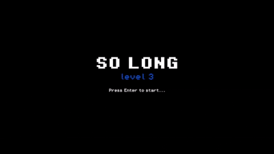

# 42_so_long

Welcome to my 42PG Pre Kick-off Project — **So Long**!

This project focuses on developing a **2D grid-based game** where the player navigates through a map, collects all collectibles, and reaches the exit to win.

As a bonus feature, I added enemies and a hidden key to increase the challenge and gameplay depth.

Since So Long is no longer part of the 42 Common Core, we are allowed to choose whether to use C with MiniLibX or Python with a supported graphics library.

For this project, I chose to develop the game using **Python and Pygame**.

---



## 🎮Game Rules

- The map is made of **walls**, **empty spaces**, **collectibles**, **enemies**, an **exit key**, an **exit** and a **player**
- Player can move **up, down, left and right**
- Player must **collect all collectibles**, before the exit key appears on map
- Player must **collect the exit key** before reaching the exit to win
- Player **cannot move through walls**
- The game is **level-based**, meaning player must complete all levels to finis the game
- The game is **over when player encounters an enemy**, and the current level can be restarted

---

## 🗺️Map Format

The map can be created manually in a .ber file by following the rules below:
| Symbol | Description |
|--------|-------------|
| `0` | Empty space |
| `1` | Wall |
| `P` | Player |
| `C` | Collectible |
| `K` | Exit key |
| `E` | Exit |
| `T` | Enemy |

- The map must be **surrounded by walls**
- The map must be **rectangular**
- All required elements except walls must be reachable
- The map must contain:
  - empty spaces ('**0**')
  - walls ('**1**')
  - exactly one player ('**P**')
  - at least one collectible ('**C**')
  - exactly one exit key ('**K**')
  - exactly one exit ('**E**')
  - enemies ('**T**') are optional

### Example map (.ber)

```txt
 111111
 1P0CK1
 100001
 1C0E01
 111111
```

---

## ⌨️Controls

| Key   | Action     |
| ----- | ---------- |
| W / ↑ | Move up    |
| S / ↓ | Move down  |
| A / ← | Move left  |
| D / → | Move right |
| ESC   | Quit game  |

---

## ⚙️Installation & Run

### Environment Requirements

- Python 3.x
- Pygame

### 📦Install Dependencies:

Install Pygame using pip:

```bash
pip install pygame
```

### 📥Clone the repo

```bash
git clone https://github.com/gabbycommit/42_so_long.git
```

### 📂Navigate into the project folder

```bash
cd 42_so_long
```

### ▶️Run the Game

```bash
python main.py
```

---

## 📚 Resources & Credits

### 🧩Pygame
- https://www.geeksforgeeks.org/python/introduction-to-pygame/

### 📐Sprite sheet and Metadata
- https://www.codeandweb.com/texturepacker/tutorials/how-to-create-a-sprite-sheet

### 🎨 Sprites
- https://arks.itch.io/dungeon-platform-tileset
- https://brackeysgames.itch.io/brackeys-platformer-bundle
- https://free-tex-packer.com/app/

### 🎵Video Game Music
- https://pixabay.com/music/search/classic%20video%20game/
- https://www.chosic.com/free-music/games/
